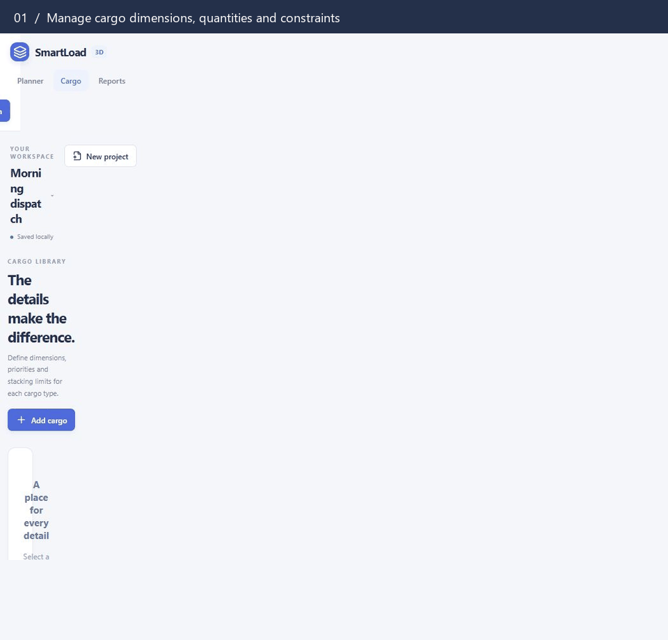

<div align="center">

# 3DSmartLoad

**Make every cubic meter count.**

Plan truck and container loading in 3D — from managing cargo and checking stacking constraints to exporting a placement report.

React 19 · TypeScript · Three.js · Vite · Web Workers

[Demo](#demo) · [Quick start](#quick-start) · [Sign in](#sign-in) · [Usage](#usage) · [Limitations](#limitations)

</div>

## Demo



A **10-second** demo captured from the real app: **Cargo → placement sequence of 18 units → Reports**. The placement sequence is time-compressed to fit the workflow into 10 seconds, and the GIF loops automatically. It was recorded before sign-in, delivery stops, axle checks, the Projects page and the report diagrams were added.

> The GIF is only a preview. Run the commands in Quick start below to use the app interactively.

## Features

| Area | What you can do |
| --- | --- |
| **Sign in** | A sign-in screen with a demo account opens the workspace; sign out from the header |
| **Planner** | Pick one of 6 vehicle presets or enter your own dimensions and payload, with 4 loading strategies |
| **Cargo** | Add, edit, duplicate, search and delete cargo, and undo deletions one at a time |
| **Delivery stops** | Give each cargo type a stop number; later stops are loaded deeper and never block earlier ones from the rear door |
| **Axle loads** | Enter axle positions and limits to see the cargo load on the front and rear axle, with a warning when a limit is exceeded |
| **3D workspace** | Orbit/zoom, switch views, toggle wireframe and mass labels, select boxes and see the center of gravity |
| **Placement sequence** | Play/pause, scrub the number of visible boxes, and return to the full load |
| **Constraint checks** | Bounds, collisions, support area, vehicle payload, door access and multi-layer load above |
| **Reports** | Volume/weight summary, unplaced cargo, a side-by-side strategy comparison, top and side drawings of the load, and a manifest with positions and load above |
| **Projects** | Keep up to 30 projects in the browser; open, duplicate and delete them from the Projects page |
| **Import & export** | Open/save project JSON, import cargo from CSV or Excel (.xlsx), export cargo CSV and manifest CSV, and print the report |
| **Local autosave** | Valid data is saved in the browser automatically and restored on reload |
| **Responsive UI** | Setup, cargo, report and project pages work on desktop and mobile |

Calculation runs in a **Web Worker** and reruns after each edit, so the UI stays responsive while packing. The 3D scene is loaded separately from the main UI.

## Quick start

### Requirements

- **Node.js 22.12+** or **20.19+**, as required by the Vite version used in this project
- npm
- A browser with WebGL and Web Workers for the 3D scene and the calculation

Download or clone this repository, then open a terminal in the project folder:

```bash
npm ci
npm run dev
```

Open the URL that Vite prints, normally **http://localhost:5173**, and [sign in](#sign-in). On first use a demo vehicle and cargo are loaded so you can try the app right away.

On Windows, if PowerShell blocks `npm.ps1`, use `npm.cmd ci` and `npm.cmd run dev`.

### Production build

```bash
npm run build
npm run preview
```

The deployable build is written to `dist/`. `preview` serves that build locally at the URL shown in the terminal; it is not a production server.

## Sign in

The app opens on a sign-in screen. Use the built-in demo account, which is also shown on the sign-in screen:

| Username | Password |
| --- | --- |
| `USER1` | `User1234!` |

Both are case-sensitive. The session lasts until you choose **Sign out** or close the browser tab.

**What this protects.** 3DSmartLoad has no backend, so sign-in is checked in the browser. The password is verified against a salted PBKDF2-SHA256 hash, but because this is a demo the account is displayed on the sign-in screen, so anyone who opens the site can sign in. It is not server-side authentication, and the project saved in `localStorage` is not encrypted. Do not rely on it to protect sensitive data on a shared or public deployment.

Sign-in uses the Web Crypto API, which browsers only provide on **HTTPS or localhost**.

To change the account, edit `AUTH_USER` and `PASSWORD_HASH` in `src/lib/auth.ts`. Generate a new hash with:

```bash
node -e "console.log(require('crypto').pbkdf2Sync('NEW_PASSWORD','smartload-3d/auth/v1',150000,32,'sha256').toString('hex'))"
```

Then update the credentials in the demo account box in `src/components/Login.tsx`, in the sign-in test in `tests/packing.test.mjs` and in this section. Remove the demo account box if the account should not be public.

## Usage

1. **Set up the vehicle** — on Planner, choose a `Vehicle preset` or enter the vehicle name, length, width, height and payload, in meters and kilograms. Turn on `Check axle loads` to enter axle positions and limits.
2. **Manage cargo** — on Cargo, add items or import a CSV/Excel file, then set size, weight, quantity, priority, delivery stop, color and the load each item can carry on top.
3. **Choose a strategy** — select a `Loading strategy`. The plan recalculates automatically when the data is valid, or press `Optimize loading` to run it again.
4. **Explore the plan** — switch between Perspective/Top/Front/Side, click a box for details, or use Play and the slider to step through the placement order.
5. **Check the result** — review space/payload utilization, axle loads and the center of gravity, then open Reports for the strategy comparison, the top and side drawings, unplaced items and the loading manifest. `Use` in the comparison switches to that strategy.
6. **Keep or share the plan** — every project is saved in the browser and listed under Projects. `Export plan` downloads a JSON file that `Import` opens as a new project. Reports exports a manifest CSV or prints/saves a PDF through the browser dialog.

### Loading strategies

| Mode | Approach | Enforces payload |
| --- | --- | :---: |
| **Compact stacking** | Stacks cargo to minimize the occupied floor area | ✓ |
| **Maximize loaded items** | Tries several loading orders, including those of the other strategies, and keeps the one that places the most units | ✓ |
| **Floor-first loading** | Fills the floor first, then stacks cargo that can be supported | ✓ |
| **Space only** | Considers space and stacking constraints and ignores payload | — |

Cargo is always ordered by delivery stop first (see below). Within a stop, every mode except Maximize loaded items sorts by priority `High → Medium → Low` before size and weight. Maximize loaded items never places fewer units than the other payload-enforcing modes, but it is still a heuristic and does not guarantee the mathematical maximum. It can take a few seconds on large, varied shipments.

### Cargo constraints

- Dimensions and weight must be positive, finite numbers.
- Quantity must be a whole number, zero or greater, with a total of up to **150 units per plan**.
- `Allow horizontal rotation` lets length and width swap without tipping the box onto another side.
- `Can support cargo above` sets whether a box may act as a base for other cargo. Turn it off for fragile goods.
- `Max load above` is the **total weight of cargo pressing down from above**, in kg, excluding the box's own weight.
- A box that cannot support cargo above may still sit on another base if the support area and load capacity are sufficient.

### Delivery stops

Each cargo type has a `Delivery stop` from 1 to 20. Stop 1 is unloaded first. The vehicle is assumed to have **one door at the rear**.

- Cargo for later stops is loaded first, so it ends up deepest in the vehicle. The stop outranks priority.
- Nothing for a later stop is placed between earlier-stop cargo and the rear door, and nothing for a later stop rests on earlier-stop cargo.
- Leave every item on stop 1 for a single-drop delivery; the plan is then the same as without stops.
- When the vehicle is too small, cargo for the earliest stops is the first to be left out, because it is loaded last.

### Axle loads

Turn on `Check axle loads` and enter where the front and rear axles are, measured in meters from the front of the cargo space (negative for an axle ahead of it, such as under the cab), and how much **cargo** weight each axle may carry. The starting values are rough estimates; replace them with the figures for your vehicle.

The cargo weight is shared between the two axles according to the load's center of gravity. The result covers cargo only, so set each limit to the axle rating minus the empty vehicle's weight on that axle. Axle limits produce a warning; they do not change where cargo is placed.

### Importing cargo from CSV or Excel

`Import CSV / Excel` on the Cargo page adds the rows of a `.csv` or `.xlsx` file to the current cargo list. The first row must contain column names.

| Column | Required | Default | Accepted names |
| --- | :---: | --- | --- |
| Name | ✓ | | `name`, `cargo`, `item`, `description` |
| Length, width, height (m) | ✓ | | `length`, `width`, `height`, `l`, `w`, `h` |
| Weight (kg) | ✓ | | `weight`, `mass` |
| Quantity | | 1 | `quantity`, `qty`, `units` |
| Priority | | Medium | `priority` (High, Medium, Low) |
| Delivery stop | | 1 | `stop`, `delivery stop`, `drop` |
| Max load above (kg) | | 2 × weight | `maxStackWeight`, `max load above` |
| Stackable, rotate | | TRUE | `stackable`, `rotate` (TRUE/FALSE, yes/no, 1/0) |
| Color | | assigned | `color` (`#rrggbb`) |
| ID | | assigned | `id` |

Column names ignore case, spaces and units in brackets, so `Length (m)` works. CSV files may use commas, semicolons or tabs. The cargo CSV that the app exports can be imported back unchanged. If any row is invalid, nothing is imported and the message names the row. For Excel, only the first worksheet of an `.xlsx` workbook is read; save older `.xls` files as `.xlsx` or `.csv` first.

## Data and saving

The app runs entirely in the browser with no backend. Data is stored in the browser's `localStorage` for the current origin, so `localhost` and `127.0.0.1` are separate stores. The sign-in session is kept in `sessionStorage`.

- Up to 30 projects are kept in local autosave and listed on the **Projects** page. **New project** and **Import** add a project; they do not replace the one that is open.
- Use **Export plan** to make backups or move a project between browsers and machines.
- The JSON file contains the vehicle, cargo list, mode and placement result. On import the data is validated, unknown fields are dropped and the plan is recalculated.
- Cargo CSV contains size, weight, quantity, priority, color, delivery stop and stacking/rotation constraints; manifest CSV contains sequence, unit, stop, coordinates, level and load above.
- Project import accepts **JSON**; cargo import accepts **CSV and .xlsx**.
- A project saved by an earlier version, when only one project was kept, opens automatically.
- Clearing browser data deletes the saved projects. Signing out does not delete them.

## How the calculation works

The packer uses a heuristic to choose positions that do not collide and stay inside the vehicle. The finished load is then centered across the vehicle width to improve left/right balance. The base of each box must be fully supported, and a base is never loaded beyond its limit.

Load is transferred through multiple layers in proportion to contact area, assuming uniformly distributed weight. Force is calculated as `mass × 9.80665 m/s²`. The center of gravity is the weight-averaged position of the placed cargo.

Axle loads treat the cargo as a single mass at its center of gravity carried by two supports: the rear axle takes `weight × (center − front axle) ÷ wheelbase` and the front axle takes the rest.

Manifest coordinates are the **center of each box**: `x` along the vehicle length, `y` for height and `z` along the width. The origin is the front-left floor corner.

## Limitations

- This is a static planning tool, not a physics simulation of a moving vehicle, and it does not guarantee a global optimum.
- Braking and cornering forces and load securing are not calculated. Axle loads cover cargo only, for two axles, and do not include the empty vehicle. The left/right and front/rear figures are the share of mass in each half of the cargo space.
- Delivery stops assume a single rear door; side doors are not modeled. Access is checked in a straight line toward the door.
- The placement order describes how the plan was built; it does not simulate the path through the doors or forklift working space.
- Space only mode can produce a plan that exceeds payload; check the result and use a payload-enforcing mode for transport planning.
- Cargo is modeled as rectangular boxes with uniformly distributed weight, up to 150 units per plan.
- Sign-in is a client-side gate, not server-side access control; see [Sign in](#sign-in).
- Before real use, check cargo access, securing, axle weights and your carrier's requirements.

## Development

### Commands

| Command | Purpose |
| --- | --- |
| `npm run dev` | Start the Vite development server |
| `npm test` | Test packing, delivery stops, axle loads, validation, imports, saved projects and sign-in |
| `npm run build` | Type-check with TypeScript and create the production build |
| `npm run preview` | Serve the production build locally |

The test suite covers payload limits, invalid data, legacy fragile cargo, stacking constraints, multi-layer load transfer, center of gravity, empty shipments, rotation, collisions, delivery-stop access, axle loads, strategy comparison, JSON/CSV/Excel import, saved projects and sign-in.

### Structure

```text
src/
├── algorithms/
│   ├── packing.ts          # Heuristic, constraints, metrics and strategy comparison
│   └── packing.worker.ts   # Background computation
├── components/
│   ├── CargoScene.tsx      # 3D scene, camera and interaction
│   ├── PlanDiagram.tsx     # Printable top and side drawings
│   ├── CargoEditor.tsx     # Cargo detail form
│   ├── Field.tsx           # Form field, metric bar and stat tile
│   ├── Login.tsx           # Sign-in screen
│   └── ProjectDialog.tsx   # New project / rename dialog
├── pages/                  # Planner, Cargo, Reports and Projects pages
├── hooks/usePlan.ts        # Plan and comparison calculation in a worker
├── data/demo.ts            # Demo vehicle and cargo
├── lib/
│   ├── auth.ts             # Sign-in check and session
│   ├── cargoImport.ts      # CSV and .xlsx cargo import
│   ├── format.ts           # Formatting, downloads, presets and strategy names
│   ├── library.ts          # Saved projects in browser storage
│   └── project.ts          # Validation, import migration and CSV export
├── types/index.ts          # Shared TypeScript types
├── App.tsx                 # Application state, header and page switching
├── main.tsx                # Entry point and sign-in gate
└── styles.css              # Responsive UI and print styles
tests/
├── packing.test.mjs        # Packing, validation and sign-in tests
├── features.test.mjs       # Stops, axles, comparison, imports and saved projects
├── load.mjs                # Loads TypeScript sources into the tests
└── fixtures/cargo.xlsx     # Sample workbook for the Excel import test
docs/assets/demo.gif        # 10-second demo for the README
scripts/build_demo_gif.py   # Composes the GIF from real screenshots (Pillow)
```

### Deploy

#### Vercel

The repository includes a `vercel.json`, so Vercel needs no manual settings: it installs with `npm ci`, builds with `npm run build` and serves `dist/`.

**From Git** — push the project to GitHub, GitLab or Bitbucket, then choose **Add New → Project** on [vercel.com](https://vercel.com/new) and import the repository. Every push to the main branch deploys again.

**From your machine** — with the [Vercel CLI](https://vercel.com/docs/cli):

```bash
npm i -g vercel
vercel          # preview deployment; the first run links or creates the project
vercel --prod   # production deployment
```

`vercel.json` also sets security headers for every response (a Content-Security-Policy that only allows the site's own scripts, plus `X-Frame-Options`, `X-Content-Type-Options`, `Referrer-Policy` and `Permissions-Policy`) and long-term caching for the hashed files in `/assets`. If you later load scripts, fonts or data from another domain, add that domain to the policy.

A deployed site is public. The sign-in screen shows the demo account, so anyone with the link can open the app; see [Sign in](#sign-in). Each visitor's projects stay in their own browser.

#### Other static hosting

Serve the contents of `dist/` from any static host with HTTPS (sign-in requires it). If you deploy under a subpath, such as a GitHub Pages project site, set `base` in `vite.config.ts` to match the repository path before building. The headers in `vercel.json` apply only on Vercel; configure equivalent headers on other hosts.

### Contributing

Before proposing a change, run `npm test` and `npm run build`. If you change the packing logic, add a regression test for the relevant case and check that the JSON result and the manifest still agree.

### Rebuilding the GIF

The current GIF is composed from real screenshots, with frame timings that add up to 10 seconds. To update it, capture the screenshots listed in `scripts/build_demo_gif.py` into `docs/demo-frames/`, then run:

```bash
python -m pip install Pillow
python scripts/build_demo_gif.py
```

The source screenshots are working files and do not need to be committed; the file shown on GitHub is `docs/assets/demo.gif`.

## License

This project does not yet include a LICENSE file. Choose a license before distributing it as open source or allowing reuse.
